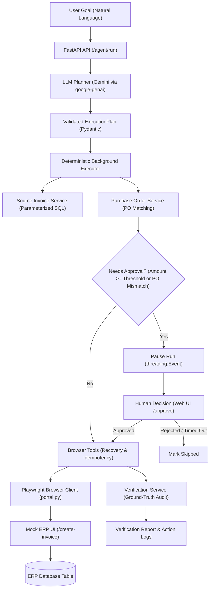
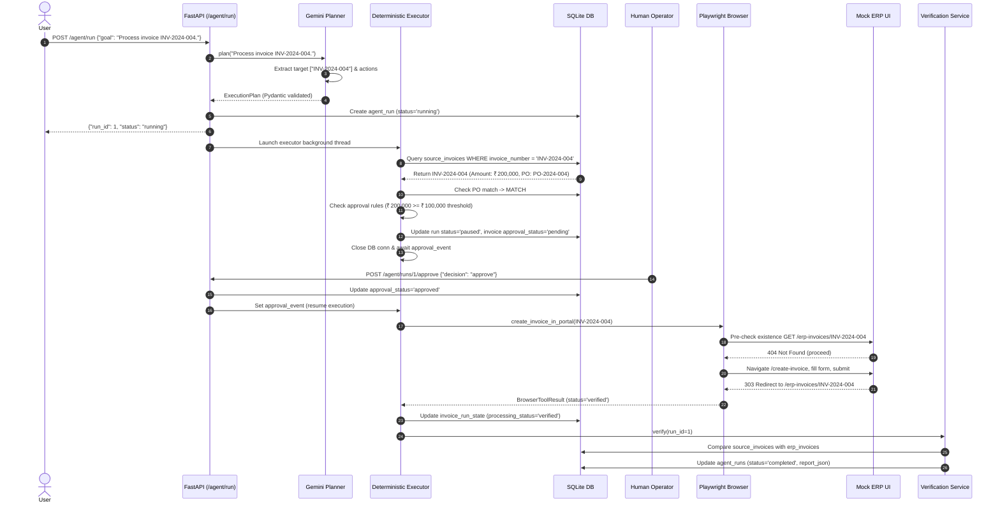
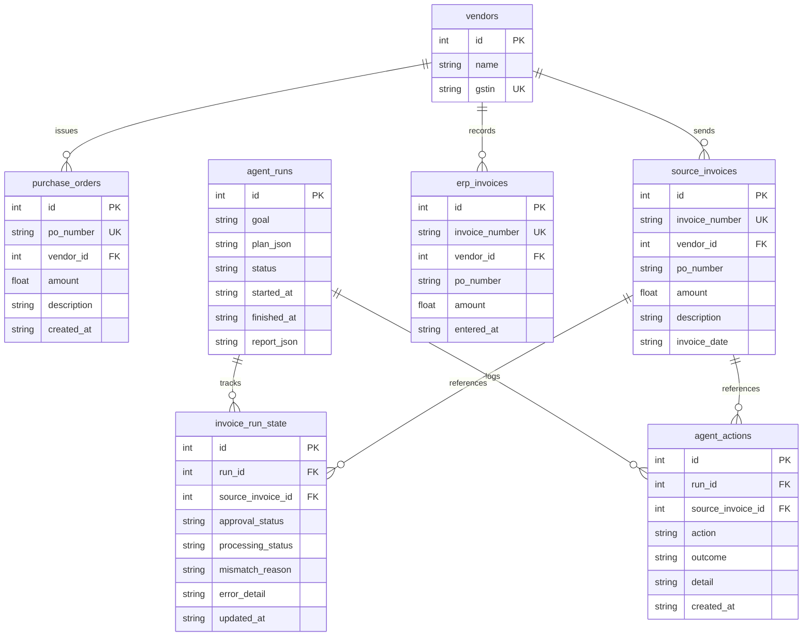

# AI Invoice-to-ERP Computer Operator

An AI-powered computer operator that converts a user's natural-language invoice-processing goal into a validated execution plan, performs browser-based ERP actions, handles human-in-the-loop approval, recovers from transient failures and duplicate submissions, and independently verifies the final ERP state.

Unlike conversational chatbots that simply answer questions or generate text, this system functions as an **autonomous computer operator**: it interprets intent, constructs a constrained plan, drives browser interactions against an ERP interface, respects human authority gates for high-value transactions, and verifies ground-truth business outcomes.

---

## 2. Problem Statement

In enterprise back-office workflows, vendor invoices arrive across multiple channels with varying amounts, item details, and purchase order (PO) references. Finance operations teams must manually:
1. Identify in-scope invoices based on managerial criteria.
2. Cross-reference invoice details against corresponding purchase orders.
3. Detect discrepancies in pricing, quantity, or missing PO references.
4. Escalate high-value or mismatched invoices for human approval.
5. Manually enter approved invoices into the ERP portal via its web UI.
6. Verify that entered records match the source documents without duplication or data entry error.

### Why Browser-Based Computer Operation?
In many enterprise environments, legacy ERP platforms, third-party portals, or external partner interfaces do not expose direct database access or comprehensive REST APIs. An AI computer operator interacts with the system through the **same user interface a human operator uses**—filling forms, submitting pages, and observing navigation results—while enforcing deterministic business rules, human approval boundaries, and automated ground-truth verification.

---

## 3. Key Capabilities

- **Natural-Language Goal Understanding**: Interprets plain-English goals (e.g., specific invoice targets, amount thresholds, PO match requirements).
- **Gemini-Based Planning**: Single structured LLM call via the `google-genai` SDK with bounded exponential backoff retries for transient 503/429 errors.
- **Pydantic Execution Plan**: Strict schema validation with allowlist checking and deterministic action sequence dependency enforcement.
- **Deterministic Execution**: Once planned, execution is 100% deterministic code; the LLM never performs ad-hoc browser clicks or data alterations.
- **Specific Invoice Targeting**: Extracts explicit targets (e.g., `INV-2024-004`) into first-class filters enforced at the database query layer.
- **Purchase-Order Matching**: Automated 3-way matching logic checking vendor identity, PO reference, and amount parity.
- **Amount & PO Mismatch Detection**: Automatically identifies discrepancies and flags invoices requiring review.
- **Human-in-the-Loop Approval Gate**: Pauses execution and releases database locks while awaiting human approval for high-value (≥ ₹1,00,000) or mismatched invoices.
- **Browser Automation via Playwright**: Headless Chromium operator navigating pages, populating form fields, submitting, and reading responses.
- **Idempotency & Pre-Submission Existence Checks**: Checks ERP existence prior to form submission; prevents duplicate entry by marking existing records as `recovered`.
- **Timeout & Failure Recovery**: Handles page timeouts with post-timeout ERP existence checks rather than blind duplicate resubmissions.
- **Three-State Existence Semantics**: Distinguishes between `found=True`, confirmed not found (`found=False, check_failed=False`), and inspection errors (`check_failed=True`).
- **Ground-Truth ERP State Verification**: Independent post-run audit querying ERP records directly to verify vendor and amount accuracy.
- **Structured Action Logging**: Append-only audit trail capturing every discrete step, outcome, and timestamp.
- **Verification Report**: Summary report classifying every invoice as `verified`, `recovered`, `failed`, or `skipped`.
- **Synthetic Seed Data**: Pre-seeded vendors, purchase orders, and source invoices covering happy paths, edge cases, and mismatch scenarios.
- **Automated Test Suite**: 24 unit and integration tests covering approval timeouts, idempotency, error semantics, plan validation, retries, and verification.

---

## 4. Architecture



### Component Details

#### API Layer (`app/api/`)
Built with FastAPI. Exposes REST endpoints for triggering agent runs (`POST /agent/run`), polling run status (`GET /agent/runs/{run_id}`), and submitting human approval decisions (`POST /agent/runs/{run_id}/approve` and `POST /agent/runs/{run_id}/approve-form`). Also hosts the mock ERP routes and server-rendered HTML pages.

#### Planner (`app/agent/planner.py`)
- Receives the natural-language goal from the API request.
- Makes **exactly one LLM planning call** to Gemini using `client.models.generate_content` with `response_mime_type="application/json"`.
- Uses a system prompt that specifies the exact JSON schema and allowed actions.
- Features bounded retries (maximum 3 retries) with exponential backoff and jitter for transient API errors (HTTP 503, 429).
- **Why the LLM does not perform browser clicks**: LLM browser control is slow, expensive, and prone to hallucinations or misclicks. Isolating the LLM strictly to high-level planning keeps execution fast, deterministic, safe, and easily testable.

#### Execution Plan (`app/schemas/agent.py`)
The bridge between LLM reasoning and deterministic execution. The `ExecutionPlan` Pydantic model validates:
1. `filters`: `min_amount`, `max_amount`, `vendor_ids`, and `invoice_numbers`.
2. `actions`: List of actions constrained strictly to `ALLOWED_ACTIONS` (`read_invoices`, `check_purchase_orders`, `create_invoices`, `flag_mismatches`, `generate_report`).
3. **Deterministic Action Sequence Validation**: Enforces that `read_invoices` precedes `check_purchase_orders`, `check_purchase_orders` precedes `create_invoices` and `flag_mismatches`, and `generate_report` occurs last. Invalid or out-of-order plans are rejected before execution starts.

#### Executor (`app/agent/executor.py`)
Dispatches validated actions in a background thread without making any LLM calls. Manages the lifecycle of the run, coordinates tool calls, handles the approval gate, and triggers verification upon completion.

#### Source Invoice Service (`app/services/source_invoice_service.py`)
Provides read-only access to immutable source invoices using parameterized SQL queries. Enforces all filter criteria including explicit invoice number targets (e.g., `WHERE si.invoice_number IN (?)`), preventing unwanted invoices from entering the pipeline.

#### Browser Layer (`app/browser/portal.py` & `app/tools/browser_tools.py`)
- `portal.py` uses Playwright (Chromium headless) to navigate to `/create-invoice`, fill form inputs (`#vendor_id`, `#invoice_number`, `#po_number`, `#amount`, `#description`), click `#submit-invoice`, and confirm arrival at `/erp-invoices/{invoice_number}`.
- `browser_tools.py` wraps raw browser actions with idempotency pre-checks and post-timeout recovery logic.
- **Why this matters**: It proves that the agent can operate real web application interfaces without backend database bypasses.

#### Mock ERP (`app/api/routes/invoices.py` & `app/templates/`)
A realistic ERP built directly into the FastAPI application. It includes form endpoints, validation, database persistence into `erp_invoices`, and HTML detail pages.

#### Verification Service (`app/services/verification_service.py`)
Performs an independent ground-truth audit. It queries `erp_invoices` directly from the database and compares each in-scope invoice against source expectations:
- `verified`: Form submitted and verified in ERP.
- `recovered`: Existed prior to submission or recovered after a submission timeout.
- `skipped`: Intentionally skipped due to human rejection or approval timeout.
- `failed`: Invoice was expected to be submitted but is missing from ERP or has amount/vendor mismatches.

---

## 5. End-to-End Execution Flow

Example Goal: `"Process invoice INV-2024-004."`



---

## 6. Human-in-the-Loop Design

High-value financial operations require human oversight to prevent unauthorized disbursements or error propagation.

### Approval Triggers
An invoice requires approval if:
1. `amount >= APPROVAL_THRESHOLD` (default: ₹1,00,000).
2. `po_status != POMatchStatus.MATCH` (e.g., amount mismatch, vendor mismatch, or missing PO reference).

### Pause & Resume Mechanism
- When an invoice requires approval, the executor updates `agent_runs.status = 'paused'`, records `invoice_run_state.approval_status = 'pending'`, closes the database connection to release SQLite locks, and calls `run_state.approval_event.wait(timeout=3600)`.
- The human operator reviews the invoice in the Agent Runs dashboard (`/agent-runs/{run_id}`) and clicks **Approve** or **Reject**.
- Upon decision, the `/approve` route updates the database and signals `approval_event.set()`, resuming the background executor.

### Outcomes
- **Approved**: Processing continues to browser submission.
- **Rejected**: Invoice is marked `processing_status = 'skipped'`, logged as rejected, and excluded from ERP entry.
- **Timeout (1 Hour)**: If no decision is received within 3600 seconds, the invoice is marked `approval_status = 'timed_out'`, `processing_status = 'skipped'`, and the executor continues with remaining invoices.

---

## 7. Failure Handling and Recovery

### 1. Browser Submission Timeouts
Network drops or slow server responses can cause browser timeouts. Blindly retrying form submission can lead to duplicate entries in the ERP.
- If form submission times out, `browser_tools.py` triggers an existence check: `portal.check_invoice_exists(invoice_number)`.
- **Found in ERP**: The server processed the request before the client timed out. The operation is marked `recovered` and no retry is attempted.
- **Confirmed Not Found**: Safe to retry submission once.
- **Check Failed (Network/Server Error)**: The system cannot confirm whether the record exists. The retry is aborted and marked `failed` to prevent duplicate creation.

### 2. Idempotency Pre-Submission Check
Before attempting form submission, `browser_tools.py` checks if the invoice already exists in the ERP. If found, submission is skipped and the state is set to `recovered`.

### 3. Three-State Existence Semantics
The browser existence checker distinguishes three precise states:
| State | `found` | `check_failed` | Meaning |
|---|---|---|---|
| **Confirmed Exists** | `True` | `False` | Detail page returned HTTP 200 and confirmed invoice record. |
| **Confirmed Absent** | `False` | `False` | Detail page returned HTTP 404 Not Found. |
| **Check Failed** | `False` | `True` | Network error, 500 error, or unparseable page. |

Treating "check failed" as "not found" would cause dangerous duplicate submissions.

### 4. PO Discrepancy Handling
If an invoice's amount does not match its purchase order (e.g., `INV-2024-011` billed at ₹82,500 vs PO of ₹75,000), the discrepancy is logged to `agent_actions`, recorded in `invoice_run_state.mismatch_reason`, and routed to the human approval gate.

---

## 8. Data Model

The application uses an SQLite database (`hulchul.db`) initialized idempotently via [app/db/models.py](file:///f:/projects/hulchul-agent/app/db/models.py).



### Table Descriptions
- **`vendors`**: Master vendor directory with tax registration (GSTIN).
- **`purchase_orders`**: Approved purchase orders against which invoices are validated.
- **`source_invoices`**: Input data representing incoming vendor bills (immutable; agent only reads).
- **`erp_invoices`**: Output records created strictly when the ERP form is submitted.
- **`agent_runs`**: High-level execution log storing goal, generated plan JSON, status, timestamps, and final verification report.
- **`invoice_run_state`**: Per-invoice state for a specific run. Decouples `approval_status` (human gate) from `processing_status` (technical outcome).
- **`agent_actions`**: Append-only audit log tracking every discrete operation and recovery step.

---

## 9. Technology Stack

| Technology | Role |
|---|---|
| **Python 3.14+** | Core programming language for application logic and agent execution. |
| **FastAPI** | Web framework powering REST API endpoints, background tasks, and ERP routes. |
| **Pydantic / Pydantic-Settings** | Schema validation, settings management, and execution plan structure enforcement. |
| **Google GenAI SDK (`google-genai`)** | Interface for Gemini LLM structured planning with automated retry resilience. |
| **SQLite3** | Embedded relational database with foreign keys and check constraints. |
| **Playwright (`playwright`)** | Headless browser automation driving the ERP portal UI. |
| **Jinja2** | Server-rendered HTML templates for the mock ERP and agent dashboards. |
| **pytest** | Unit and integration test runner for plan validation, timeouts, idempotency, and verification. |
| **python-dotenv** | Environment variable management loading configuration from `.env`. |
| **Uvicorn** | ASGI server running the FastAPI web application. |

---

## 10. Project Structure

```
hulchul-agent/
├── app/
│   ├── agent/                      # Agent planning and orchestration
│   │   ├── executor.py             # Deterministic plan executor & approval gate
│   │   ├── planner.py              # Gemini LLM planner with retry handling
│   │   └── state.py                # Threading events for human-in-the-loop pause/resume
│   ├── api/                        # FastAPI route controllers
│   │   ├── routes/
│   │   │   ├── agent.py            # Agent run trigger, status, and approval routes
│   │   │   ├── invoices.py         # Mock ERP JSON & form submission routes
│   │   │   ├── pages.py            # Server-rendered HTML page routes
│   │   │   └── purchase_orders.py  # PO query routes
│   ├── browser/                    # Raw Playwright browser interactions
│   │   └── portal.py               # Form navigation, input filling, and existence checks
│   ├── core/                       # Application configuration
│   │   └── config.py               # Pydantic Settings singleton reading from .env
│   ├── db/                         # Database layer
│   │   ├── database.py             # SQLite connection management
│   │   ├── models.py               # DDL schema definitions and init_db()
│   │   └── seed.py                 # Synthetic dataset generation
│   ├── schemas/                    # Pydantic validation models
│   │   ├── agent.py                # ExecutionPlan, FilterConfig, and Approval models
│   │   ├── invoice.py              # Invoice request/response schemas
│   │   ├── purchase_order.py       # PO matching schemas and status Enums
│   │   ├── vendor.py               # Vendor schemas
│   │   └── verification.py         # Verification report schemas
│   ├── services/                   # Business domain services
│   │   ├── erp_invoice_service.py  # ERP database operations
│   │   ├── po_service.py           # PO 3-way matching logic
│   │   ├── source_invoice_service.py # Parameterized source invoice queries
│   │   └── verification_service.py # Post-run ground-truth audit service
│   ├── static/                     # Static UI assets (CSS styling)
│   │   └── style.css
│   ├── templates/                  # Jinja2 HTML templates
│   │   ├── agent_run.html          # Run detail, action log, and approval UI
│   │   ├── agent_runs.html         # Runs overview list
│   │   ├── create_invoice.html     # ERP invoice creation form
│   │   ├── dashboard.html          # Main operational dashboard
│   │   ├── erp_invoices.html       # ERP invoices list
│   │   ├── purchase_orders.html    # Purchase orders list
│   │   └── source_invoices.html    # Source invoices list
│   ├── tools/                      # Deterministic tools dispatched by executor
│   │   ├── browser_tools.py        # Browser execution with recovery and idempotency
│   │   └── invoice_tools.py        # Database-backed tools for invoice operations
│   └── main.py                     # FastAPI app factory, startup events, and mounting
├── tests/                          # Automated test suite (24 tests)
│   ├── test_approval_timeout.py    # Tests for timeout semantics and human decisions
│   ├── test_idempotency_and_error_semantics.py # Tests for pre-checks and recovery
│   ├── test_plan_validation.py     # Tests for sequence rules, filtering, and planner retries
│   └── test_verification.py        # Tests for post-run ground-truth verification
├── .env.example                    # Environment variable template
├── .gitignore                      # Git exclusion rules
├── requirements.txt                # Project dependencies
└── README.md                       # System documentation
```

---

## 11. Setup Instructions (Windows PowerShell)

### 1. Clone Repository & Navigate
```powershell
git clone <repository-url>
cd hulchul-agent
```

### 2. Create and Activate Virtual Environment
```powershell
python -m venv .venv
.\.venv\Scripts\Activate.ps1
```

### 3. Install Dependencies
```powershell
pip install -r requirements.txt
```

### 4. Install Playwright Chromium Browser
```powershell
playwright install chromium
```

### 5. Configure Environment Variables
Copy [.env.example](file:///f:/projects/hulchul-agent/.env.example) to `.env`:
```powershell
Copy-Item .env.example .env
```
Open `.env` and set your `GOOGLE_API_KEY`:
```ini
GOOGLE_API_KEY=your_actual_gemini_api_key
LLM_MODEL=gemini-3.5-flash
APPROVAL_THRESHOLD=100000
DATABASE_URL=./hulchul.db
LOG_LEVEL=INFO
```

### 6. Start Application
```powershell
python -m uvicorn app.main:app --reload --port 8000
```
On startup, the SQLite database (`hulchul.db`) is automatically created and populated with synthetic seed data.

### 7. Access Web Dashboard
Open your browser at [http://localhost:8000](http://localhost:8000).

---

## 12. Environment Variables

| Variable | Description | Default Value |
|---|---|---|
| `GOOGLE_API_KEY` | Google Gemini API key used for structured planning. | `""` (Required) |
| `LLM_MODEL` | Gemini model name for the planner call. | `gemini-3.5-flash` |
| `APPROVAL_THRESHOLD` | Invoices at or above this INR amount pause for human approval. | `100000` |
| `DATABASE_URL` | Filepath or URI for the SQLite database. | `./hulchul.db` |
| `LOG_LEVEL` | Application logging verbosity (`DEBUG`, `INFO`, `WARNING`, `ERROR`). | `INFO` |

> [!IMPORTANT]
> Never commit `.env` or real API keys to version control. The repository `.gitignore` explicitly excludes `.env`.

---

## 13. Running an Agent

### Specific Invoice Goal
Process a single named invoice:
```powershell
$body = @{
    goal = "Process invoice INV-2024-004."
} | ConvertTo-Json

Invoke-RestMethod -Uri "http://localhost:8000/agent/run" -Method POST -ContentType "application/json" -Body $body
```
**Response:**
```json
{
  "run_id": 1,
  "status": "running"
}
```

### Broader Filtering Goal
Process all high-value invoices with PO matches:
```powershell
$body = @{
    goal = "Process all invoices above 50000 that have an exact purchase-order match."
} | ConvertTo-Json

Invoke-RestMethod -Uri "http://localhost:8000/agent/run" -Method POST -ContentType "application/json" -Body $body
```

### Monitoring the Run
Navigate to [http://localhost:8000/agent-runs](http://localhost:8000/agent-runs) or [http://localhost:8000/agent-runs/1](http://localhost:8000/agent-runs/1) to view the live plan, execution steps, approval prompts, and verification report.

---

## 14. UI Pages

- **Dashboard (`/`)**: Overview metrics showing count of source invoices, ERP entries, purchase orders, and recent runs.
- **Source Invoices (`/source-invoices`)**: List of all incoming vendor invoices waiting in the system inbox.
- **Purchase Orders (`/purchase-orders`)**: Catalog of active POs with amounts and assigned vendors.
- **ERP Invoices (`/erp-invoices`)**: Current ground-truth ERP records populated via browser automation.
- **Create Invoice (`/create-invoice`)**: Form interface operated by Playwright during agent runs.
- **Agent Runs (`/agent-runs`)**: Audit table of all historical and active agent runs with status badges.
- **Run Detail (`/agent-runs/{run_id}`)**: Detailed view containing the generated plan, per-invoice state table, action audit logs, human approval actions, and the final verification report card.

---

## 15. Testing

The project includes an automated test suite verifying deterministic business logic, plan sequence validation, failure recovery, timeouts, and ground-truth verification without invoking external LLMs or live browsers.

Run the test suite:
```powershell
python -m pytest
```

### Test Coverage (24 Passed Tests)
- **`tests/test_plan_validation.py`**: Validates allowed actions, action ordering dependencies, plan schema enforcement, LLM transient retry handling (503), fast-failing on 404s, and target invoice filtering.
- **`tests/test_approval_timeout.py`**: Tests approval pause/resume mechanics, 1-hour timeout handling (`timed_out` / `skipped`), human rejection, and DB connection release during wait.
- **`tests/test_idempotency_and_error_semantics.py`**: Tests pre-submission idempotency, timeout recovery paths, and distinction between "not found" and "check failed".
- **`tests/test_verification.py`**: Tests post-run ground-truth audit matching source data against ERP records.

---

## 16. E2E Scenarios

### Scenario 1: Specific Invoice Processing
- **Goal**: `"Process invoice INV-2024-004."`
- **Result**: The planner extracts `invoice_numbers: ["INV-2024-004"]`. The database query loads only `INV-2024-004`. Because its amount is ₹2,00,000 (≥ ₹1,00,000 threshold), the run pauses for human approval. Once approved, Playwright submits the form and marks it `verified`.

### Scenario 2: Human Approval for High-Value Invoices
- **Goal**: `"Process all invoices."`
- **Result**: Invoices exceeding ₹1,00,000 (e.g., `INV-2024-002`, `INV-2024-004`, `INV-2024-006`) trigger the approval gate. Invoices below threshold with exact PO matches (e.g., `INV-2024-001` for ₹75,000) are auto-approved and submitted immediately.

### Scenario 3: Purchase Order Mismatch Detection
- **Goal**: `"Process all invoices."`
- **Result**: `INV-2024-011` (billed at ₹82,500 against PO of ₹75,000) is flagged with mismatch reason `"Amount mismatch: invoice ₹82,500 != PO ₹75,000"`. Execution pauses for human review rather than blindly submitting inaccurate financial data.

### Scenario 4: Idempotent Recovery
- **Goal**: Submitting an invoice that was previously entered into the ERP.
- **Result**: Pre-submission check finds the invoice already in `/erp-invoices/{invoice_number}`. Browser submission is skipped, avoiding duplicate entry errors, and marked `recovered`.

---

## 17. Key Engineering Decisions

1. **Single LLM Planning Call**: The LLM is invoked once at the beginning of a run to interpret natural-language intent and construct an execution plan. This avoids token bloat, reduces latency, eliminates compounding nondeterminism, and minimizes operational costs.
2. **Deterministic Browser Execution**: The LLM never decides where to click or type. Deterministic Python code locates selectors, inputs data, and validates redirects.
3. **Pydantic Validation Barrier**: Model output is treated as untrusted input. Strict Pydantic validators reject malformed schemas or out-of-order action sequences before execution starts.
4. **Browser-Based Computer Operation**: Rather than writing directly to SQL tables, Playwright operates the ERP UI directly, demonstrating true computer operation capable of working with legacy or third-party web portals.
5. **Independent Ground-Truth Verification**: The system does not trust browser return codes or agent logs alone. A separate verification service reads the actual ERP database table to confirm that data was correctly entered.
6. **Idempotency & Three-State Recovery**: Built-in existence checks prevent duplicate records during network timeouts or repeated runs.
7. **Safe DB Connection Lifecycle**: Closes SQLite connections during human approval waits to prevent long-lived database locks and concurrency deadlocks.

---

## 18. Security and Safety

- **Zero Real Credentials Required**: All tests and demos run against local synthetic seed data and mock vendors.
- **Environment Isolation**: API keys and environment configurations are loaded via Pydantic Settings and excluded from version control via `.gitignore`.
- **SQL Injection Prevention**: All database interactions in services and tools use parameterized SQL queries (`?` placeholders).
- **Human Authority Boundary**: The system cannot bypass approval gates for transactions exceeding configured thresholds or with PO discrepancies.
- **No Direct Destructive Access**: The agent operates within the browser and cannot perform unconstrained administrative database operations.

---

## 19. Limitations & Production Considerations

- **Mock ERP vs Production ERP**: Built against a local FastAPI mock ERP. A production deployment would target enterprise portals (e.g., SAP, Oracle, NetSuite) with SAML/OAuth authentication and anti-bot handling.
- **Local Single-Process Concurrency**: Pausing and resuming runs uses in-memory `threading.Event` objects. Production systems would use a persistent task queue (e.g., Celery, Temporal, or AWS SQS) with Redis or PostgreSQL.
- **UI Selector Fragility**: Playwright relies on stable DOM IDs. In production, visual fallback or self-healing selectors would improve resilience against UI layout changes.
- **API Availability & Quotas**: LLM planning depends on Gemini API availability; bounded retries mitigate transient 503/429 spikes, but offline planning requires local models.

---

## 20. AI / External Libraries Disclosure

- **Google Gemini via `google-genai`**: Used exclusively for natural-language understanding and initial plan generation.
- **Playwright**: Used for headless browser execution and DOM inspection.
- **Pydantic**: Used for strict schema validation, type safety, and sequence constraint enforcement.
- **FastAPI & SQLite**: Used for application routing, mock ERP implementation, and relational data persistence.

> *The LLM proposes a validated execution plan; deterministic application code performs the actual workflow.*

---

## 21. Future Improvements (Not Currently Implemented)

- **Persistent Workflow State**: Migrating in-memory threading events to Temporal or Celery for durable multi-day approval workflows across server restarts.
- **Enterprise ERP Connectors**: Pre-built Playwright adaptors for SAP S/4HANA, Oracle Fusion, and Workday.
- **Document AI OCR Ingestion**: Direct PDF/image invoice parsing before passing structured text to the source invoice pipeline.
- **Multi-Factor Authentication (MFA) Handling**: Interactive browser sessions allowing human-assisted MFA handoffs.
- **Configurable Rule Engine**: User-definable approval threshold matrices based on department, vendor risk tier, or expense category.

---

## 22. Assignment Note

This project was built as an **AI Engineering Internship Assignment**, demonstrating how large language models can be combined with deterministic execution, browser automation, human-in-the-loop safeguards, and ground-truth verification to build reliable computer operators.
